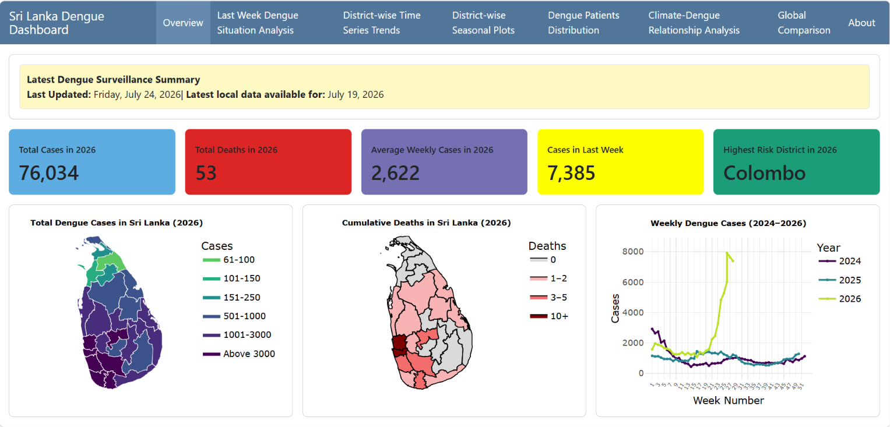
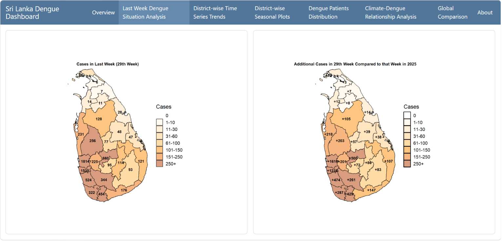
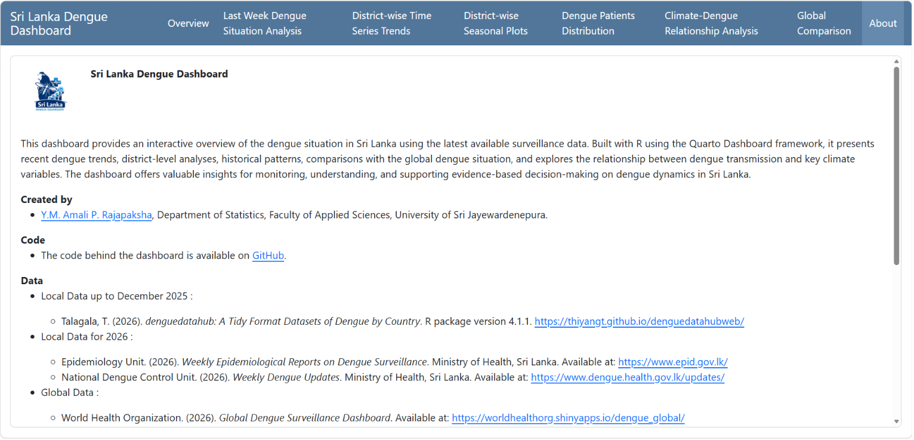

## **Abstract**

These days, Sri Lanka is facing a severe dengue outbreak. In this situation, it is very useful to provide an overall understanding of Sri Lanka's historical dengue trends as well as the current dengue situation. A dashboard is an easy and effective way to convey a large amount of information to the public. Therefore, the **Sri Lanka Dengue Dashboard** is an initial attempt to provide comprehensive information about the dengue situation in Sri Lanka, together with the relationship between climate factors and dengue cases.\
\
**Keywords** :  Data visualization, Heat map, Climate-dengue relationship, Tree map, Time series analysis, Quato, Dashboard, Dengue fever

# 1 Introduction

Dengue is endemic in more than 100 tropical and subtropical countries worldwide [@paz2024dengue]. It is transmitted to humans through the bites of infected Aedes mosquitoes. Currently, there are no specific medicines for dengue fever, and a person can be infected with dengue more than once during his or her lifetime [@who2025dengue]. Hence, prevention is better than cure in this case.

Asian countries such as Bangladesh, India, Thailand, and Sri Lanka also face dengue outbreaks. Currently, Sri Lanka is experiencing an increasing trend in dengue cases. Therefore, having a better understanding of past trends, seasonal patterns, and the current dengue situation may help to prevent and control the disease.

In this context, an interactive dashboard is an effective way to communicate a large amount of information to the public, health professionals, and decision-makers in a simple and accessible manner. There are many dashboards designed to visualize the global and local dengue situation. Among those, I studied six different dashboards covering the worldwide, Asian, South-East Asian regional, and country-level dengue situations in selected South-East Asian countries. Based on the insights gained from these dashboards, I developed a dashboard specifically for Sri Lanka. This dashboard provides an interactive overview of the dengue situation in Sri Lanka using the latest available surveillance data. Built with R using the Quarto Dashboard framework, it presents recent dengue trends, district-level analyses, historical patterns, comparisons with the global dengue situation, and explores the relationship between dengue transmission and key climate variables. The dashboard offers valuable insights for monitoring, understanding, and supporting evidence-based decision-making on dengue dynamics in Sri Lanka.

The remaining sections of this paper are organized as follows. Section 2 presents a brief literature review based on six dashboards developed for different contexts using dengue surveillance data. Section 3 describes the methodologies used in developing the dashboard. Section 4 presents the results and the possible insights obtained from the dashboard. Finally, Section 5 provides the discussion and concluding remarks.

# 2 Literature Review

In this literature review, six dengue-related dashboards were considered. These dashboards were developed for different geographical areas. The review focuses on the information presented, visualization techniques, and key features of each dashboard. A summary of the studied dashboards is presented in @tbl-dashboard-summary. 

\begin{longtable}{|c|p{3.3cm}|p{2.8cm}|p{4.7cm}|p{2.8cm}|}
\caption{Summary of dengue surveillance dashboards considered in the literature review}
\label{tbl-dashboard-summary}
\hline
\textbf{No.} & \textbf{Dashboard Name} & \textbf{Geographical Area Covered} & \textbf{Data Included in the Dashboard} & \textbf{Citation} \\
\hline
\endfirsthead

\multicolumn{5}{c}%
{{\bfseries Table \thetable\ Continued from previous page}} \\
\hline
\textbf{No.} & \textbf{Dashboard Name} & \textbf{Geographical Area Covered} & \textbf{Data Included in the Dashboard} & \textbf{Citation} \\
\hline
\endhead

\hline
\multicolumn{5}{r}{{Continued on next page}}\\
\endfoot

\hline
\endlastfoot


1 & Global Dengue Surveillance Dashboard & Worldwide &  Total cases, Confirmed cases, Severe cases, Deaths, Total cases per 100 000, Geographic distribution, Frequencies by serotype, Global dengue transmission range estimates (2023)  & (WorldHealth Organization, 2026) 
 \\
\hline

2 & Asia Dengue Voice and Action: Dengue Dashboard  & Asia Region & Weekly Dengue Cases, Total Dengue Cases, Total Dengue Deaths
& (AsianDengue Voice and Action, 2026)\\
\hline

3 & Dengue Dashboard: South-East Asia Region & South-East Asia Region & Total Dengue Cases, Confirmed Dengue Cases, Dengue Deaths, Gender \& Age overview
, Severity overview
, Serotyping, Country profile, Clinical Management & (WorldHealth Organization Regional Office for South-East Asia, 2026) \\
\hline

4 & Dengue Dynamic Dashboard for Bangladesh & Bangladesh & Weekly Cases, Weekly Deaths, Cumulative Cases, Cumulative Deaths, Dengue cases for last 24 hours, Dengue deaths for last 24 hours, Division \& City corporation cases of last 24 hours, Division \& City corporation deaths of last 24 hours, Age group distribution of affected cases of last 24 hours, Gender distribution of affected cases of last 24 hours & (DirectorateGeneral of Health Services (DGHS), Bangladesh, 2026)\\
\hline

5 & WHO Health Emergencies Dashboard: Outbreaks - Afghanistan & Afghanistan & Suspected cases, Geographical distribution of Suspected Dengue Fever Cases by District, Dengue fever cases by gender, Dengue fever cases by age group, Dengue fever deaths by gender and age & (WorldHealth Organization, 2026)
 \\
\hline

6 & Dengue Daily Data Dashboard: Karnataka & Karnataka & Daily Counts for All Districts, Weekly Trend, Bi-Weekly Trend, Monthly Trend & (InternationalCentre for Theoretical Sciences (ICTS), 2026)
 \\
\hline

\end{longtable}

@tbl-dashboard-features numbers correspond to those listed in @tbl-dashboard-summary. The comparison focuses on the number of tabs, background theme, suitability for a single-screen layout, data availability, and the visualization techniques used in each dashboard.

\begin{longtable}{|c|c|p{2cm}|p{2cm}|p{2.5cm}|p{4.7cm}|}
\caption{Comparison of visualization techniques and key features of the reviewed dengue dashboards}
\label{tbl-dashboard-features}
\hline
\textbf{No.} &
\textbf{No. of Tabs} &
\textbf{Background Theme} &
\textbf{Single-Screen Layout} &
\textbf{Public Data Availability} &
\textbf{Visualization Techniques} \\
\hline
\endfirsthead

\multicolumn{6}{c}{{\bfseries Table \thetable\ Continued from previous page}}\\
\hline
\textbf{No.} &
\textbf{No. of Tabs} &
\textbf{Background Theme} &
\textbf{Single-Screen Layout} &
\textbf{Public Data Availability} &
\textbf{Visualization Techniques} \\
\hline
\endhead

\hline
\multicolumn{6}{r}{{Continued on next page}}\\
\endfoot

\hline
\endlastfoot

1 & 7 & light & No & Available & KPIs, Choropleth Map, Bar Chart, Area chart, Stacked Bar Chart,   \\
\hline

2 & 1 & light & No & Not Available & Choropleth Map, Line Chart \\
\hline

3 & 6 & light & No & Available & KPIs, Choropleth Map, Bar Chart, Area chart, Stacked Bar Chart, Tree Map, Heatmap, Line Chart \\
\hline

4 & 1 & light & No & Not Available & KPIs, Bar Chart, Line Chart, Pie Chart,  \\
\hline

5 & 1 & light & No & Not Available & Choropleth Map, Bar Chart, Donut Chart \\
\hline

6 & 6 & light & No & Available & Choropleth Map, Line Chart \\
\hline

\end{longtable}

Among these dashboards, tree maps and heatmaps were used in only one dashboard, while line charts and bar charts were used most frequently.

# 3 Data

All local data up to December 2025 used in this dashboard were obtained from the weekly epidemiological reports published by the Epidemiology Unit, Ministry of Health, Sri Lanka, through the `denguedatahub` R package [@talagala2026denguedatahub]. Data for 2026 were obtained from the weekly epidemiological reports [@epidemiology_unit_2026] published by the Ministry of Health, Sri Lanka, and the Weekly Dengue Updates [@national_dengue_control_unit_2026] published by the Ministry of Health, Sri Lanka . These data were extracted through web scraping using the `convert_slwer_to_tidy()` function available in the `denguedatahub` package [@talagala2026denguedatahub]. The global data used in this dashboard were obtained from the World Health Organization's [Global Dengue Surveillance Dashboard](https://worldhealthorg.shinyapps.io/dengue_global/) [@who2026globaldenguedashboard]. The climate data used in this study were downloaded from the [NASA POWER Data Access Viewer](https://power.larc.nasa.gov/data-access-viewer/) [@nasa_power_2026].

# 4 Methodology

Here, several visualization techniques have been used for different purposes. To explore new visualization techniques that can be applied for disease surveillance and epidemiological analysis, the Sri Lanka COVID-19 Dashboard [@talagala2022interactive] was referred to. To get an overall idea of the methodologies, see @tbl-methods.

\begin{longtable}{|p{9cm}|p{6cm}|}
\caption{Summary of methodologies used in the dashboard}
\label{tbl-methods}
\hline
\textbf{Information Presented} & \textbf{Visualization Technique(s)} \\
\hline
\endfirsthead

\multicolumn{2}{c}%
{{\bfseries Table \thetable\ Continued from previous page}}\\
\hline
\textbf{Information Presented} & \textbf{Visualization Technique(s)} \\
\hline
\endhead

\hline
\multicolumn{2}{r}{{Continued on next page}}\\
\endfoot

\hline
\endlastfoot
Key Information about the Present Dengue Situation in Sri Lanka & KPIs \\
\hline
Distribution of Total Dengue Cases in Sri Lanka in 2026 & Choropleth Map \\
\hline
Cumulative Dengue Deaths in Sri Lanka in 2026 & Choropleth Map \\
\hline
Anomalous Dengue Behaviour in the Current Period Compared with the Previous Two Years in Sri Lanka & Time Series Plot \\
\hline
Last Week's Dengue Situation Analysis & Choropleth Maps \\
\hline
District-wise Weekly Dengue Case Analysis Over Time until 2025 & Faceted and Individual Time Series Plots, Faceted and Individual Seasonal Plots \\
\hline
Distribution of Dengue Patients by District and Year until 2025 & Tree Map, Faceted Choropleth Map, Heatmap \\
\hline
Relationship Between Climatic Variables and Dengue Cases & Multi-panel Time Series Plot, Scatterplots \\
\hline
Global Distribution of Dengue Patients/Cases in 2025 & Choropleth Map \\
\hline
Sri Lanka Compared with the Top 10 Dengue-Affected Countries Worldwide and Other South-East Asian countries in 2025 & Stacked Bar Chart \\
\hline
\end{longtable}

One of the additional analyses included in this dashboard is the climate-dengue relationship analysis. In addition to time series plots (@fig-tab6(a)) and scatter plots (@fig-tab6(b)) of climatic variables vs. dengue cases, I explored the potential lag effect using two-week and four-week lag scatter plots (@fig-tab6(c) , @fig-tab6(d)). Dengue transmission does not respond immediately to climatic changes such as rainfall and humidity. Instead, favourable climatic conditions may enhance mosquito breeding and contribute to increased dengue cases after a certain time lag. Based on this idea, I explored the lag relationship between climatic factors and dengue cases. Furthermore, to obtain a comprehensive understanding of the relationship between climatic variables and dengue cases, the Detrended Cross-Correlation Coefficient ($\rho_{DCCA}$) was calculated across different time scales [@figueredo2023analysis]. This method is used to study the relationship between multiple time series that change over time, even when the data are not stationary [@zebende2018rhodcca]. The calculated $\rho_{DCCA}$ values were plotted over different time scales to investigate how climatic variables influence dengue occurrence across short, medium and long-term periods.

In this dashboard, several colour palettes were used ensuring that the visualizations are colour-blind friendly. These include the Viridis palette from the viridis package [@garnier2018package], the Paired palette from the ColorBrewer collection [@harrower2003colorbrewer], and the Magma palette from the Viridis colour map family [@garnier2018package]. In addition, some colour themes were manually defined according to the context of the visualizations.

In this dashboard, multiple visualization techniques have sometimes been used for the same data. Although the data are the same, each visualization provides different insights that can be directly obtained from the data. Therefore, using multiple plots for the same data helps explore different aspects of the actual situation more comprehensively.

# 5 Results

The dashboard is organized into 8 navigation tabs, including Overview, Last Week Dengue Situation Analysis, District-wise Time Series Trends, District-wise Seasonal Plots, Dengue Patients Distribution, Climate-Dengue Relationship Analysis, Global Comparison, and About. Each tab contains interactive visualizations and analytical outputs. @tbl-tabs provides a description of each tab and summarizes its key content.

\begin{longtable}{|p{2cm}|p{13cm}|}
\caption{Description of Dashboard Tabs}
\label{tbl-tabs}
\hline
\textbf{Tab No.} & \textbf{Description} \\
\hline
\endfirsthead

\multicolumn{2}{c}%
{{\bfseries Table \thetable\ Continued from previous page}}\\
\hline
\textbf{Tab No.} & \textbf{Description} \\
\hline
\endhead

\hline
\multicolumn{2}{r}{{Continued on next page}}\\
\endfoot

\hline
\endlastfoot
Tab 1 & This provides the latest information about the dengue epidemic in Sri Lanka. It gives a brief overview of the current dengue situation in Sri Lanka. \\
\hline
Tab 2 & This compares the dengue situation in the 29th week of this year with the same week of the previous year. This is the latest data we have. \\
\hline
Tab 3 & There are two sub-tabs. The first contains faceted time series plots of weekly dengue cases from 2006 to 2025 for each district separately. The second tab allows users to explore small changes in dengue cases for each district individually using dygraphs. \\
\hline
Tab 4 & There are two sub-tabs. The first contains faceted seasonal plots of weekly dengue cases from 2006 to 2025 for each district separately. The second tab allows users to explore small changes in seasonal patterns for each district individually using Plotly graphs. \\
\hline
Tab 5 & There are three sub-tabs. The first contains a treemap showing the distribution of total dengue patients in 2025. The second and third sub-tabs contain the distribution of dengue patients over the last 20 years by district and year.   \\
\hline
Tab 6 & This section contains five sub-tabs and provides a comprehensive analysis of the relationship between climatic variables and dengue cases. The first four sub-tabs present time series plots and scatter plots to explore temporal patterns and associations between climatic variables and dengue incidence. The fifth sub-tab presents a map displaying the calculated raw DCCA values across different time scales.\\
\hline
Tab 7 & This section has three sub-tabs. The first shows the distribution of dengue patients worldwide in 2025. The second and third sub-tabs compare the dengue situation in Sri Lanka with the global and South-East Asia region levels, respectively. \\
\hline
Tab 8 & This contains detailed information about the dashboard, data sources, references, and other related information. \\
\hline
\end{longtable}


```{r}
#| label: fig-tab1
#| fig-pos: "H"
#| fig-cap: "Screenshot of Tab 1 (Overview)"
#| echo: false


```

According to @fig-tab1, a rapid increase in dengue cases can be observed in 2026 from around the 21st week compared with 2024 and 2025. Public sources suggest that this increase may be associated with enhanced Aedes mosquito breeding due to favourable climatic conditions, post-flood environmental changes following Cyclone Ditwah, urbanization-related breeding habitats, and ongoing dengue virus transmission dynamics.

```{r}
#| label: fig-tab2
#| fig-pos: "H"
#| fig-cap: "Screenshot of Tab 2 (Last Week Dengue Situation Analysis)"
#| echo: false


```

@fig-tab2 also proves the severity of the situation Sri Lanka faces today. Approximately, the number of cases reported in the 29th week this year is nearly twice that of the same week last year.\

```{r}
#| label: fig-tab3
#| fig-pos: "H"
#| fig-cap: "Screenshot of Tab 3 (District-wise Time Series Trends)"
#| fig-subcap:
#| - ""
#| - ""
#| layout-ncol: 2
#| out-width: "98%"
#| echo: false

knitr::include_graphics(c(
  "images/tab3.a.png",
  "images/tab3.b.png"
))
```

@fig-tab3(a) shows that many districts experienced notable peaks in dengue cases during 2017, 2019, and 2023. Among these, the 2017 outbreak was the most severe, with consistently high case counts across nearly all districts. According to published reports, Sri Lanka recorded its largest dengue outbreak in 2017, with 186,101 suspected cases and 440 deaths nationwide. Preliminary laboratory investigations identified Dengue virus serotype 2 (DENV-2) as the predominant circulating strain associated with this outbreak. Heavy monsoon rains and flooding also contributed to the outbreak by creating favourable breeding conditions for Aedes mosquitoes through standing water and inadequate waste management, leading to increased transmission, particularly in urban and suburban areas.

Dengue transmission in Sri Lanka shows a clear seasonal pattern, with two annual peaks corresponding to the Southwest (May to September) and Northeast (October to January) monsoon periods. However, this pattern is not observed uniformly across all districts.

```{r}
#| label: fig-tab4
#| fig-pos: "H"
#| fig-cap: "Screenshot of Tab 4 (District-wise Seasonal Plots)"
#| fig-subcap:
#| - ""
#| - ""
#| layout-ncol: 2
#| out-width: "98%"
#| echo: false

knitr::include_graphics(c(
  "images/tab4.a.png",
  "images/tab4.b.png"
))
```

The Southwest monsoon mainly affects districts such as Colombo, Gampaha, Kalutara, Galle, Matara, Hambantota, Kandy, Matale, Nuwara Eliya, Ratnapura, Kegalle, Puttalam, and Kurunegala. In contrast, districts such as Trincomalee, Batticaloa, Ampara, Jaffna, Kilinochchi, Mannar, Mullaitivu, Vavuniya, Badulla, and Monaragala are not significantly affected by the Southwest monsoon. This difference is clearly visible in @fig-tab4(a). While the Southwest monsoon affected districts show annual peaks in dengue cases during the period from May to September, districts such as Trincomalee, Batticaloa, Ampara, Jaffna, Kilinochchi, Mannar, Vavuniya, Badulla, and Monaragala do not exhibit a similar seasonal peak during this period.

```{r}
#| label: fig-tab5
#| fig-pos: "H"
#| fig-cap: "Screenshot of Tab 5 (Dengue Patients Distribution)"
#| fig-subcap:
#| - ""
#| - ""
#| - ""
#| layout-ncol: 2
#| layout-nrow: 2
#| out-width: "98%"
#| echo: false

knitr::include_graphics(c(
  "images/tab5.a.png",
  "images/tab5.b.png",
  "images/tab5.c.png"
))
```


@fig-tab5(c) shows that the Western Province, particularly the districts of Colombo, Gampaha, and Kalutara, has consistently reported the highest dengue burden in the country. As shown in @fig-tab5(b), these districts are geographically very small. However, the Western Province serves as Sri Lanka's administrative, commercial, and economic hub, attracting a large number of people to live and work in these areas.

Consequently, the population density in these districts is exceptionally high. In addition, rapid urbanization, extensive construction activities, environmental conditions favourable for mosquito breeding, and increased human mobility have further contributed to the high transmission of dengue in the region. @fig-tab5(a) clearly illustrates the hierarchical distribution of dengue cases across all districts in 2025 using a treemap.

```{r}
#| label: fig-tab6
#| fig-pos: "H"
#| fig-cap: "Screenshot of Tab 6 (Climate-Dengue Relationship Analysis)"
#| fig-subcap:
#| - ""
#| - ""
#| - ""
#| - ""
#| - ""
#| layout-ncol: 2
#| layout-nrow: 3
#| out-width: "98%"
#| echo: false

knitr::include_graphics(c(
  "images/tab6.a.png",
  "images/tab6.b.png",
  "images/tab6.c.png",
  "images/tab6.d.png",
  "images/tab6.e.png"
))
```

@fig-tab6(a) shows a clearly visible relationship between dengue cases and climatic variables, particularly relative humidity, temperature, and rainfall. According to the figure, dengue cases increase when relative humidity is high and temperature is low. During periods with high dengue cases, rainfall is also higher than during other periods.

When @fig-tab6(b), @fig-tab6(c), and @fig-tab6(d) are examined, the above-mentioned lag effect can be clearly seen. Among them, the scatter plots in @fig-tab6(b) at a lag of 4 weeks show that the points are more closely clustered and move in the same direction. This indicates a positive relationship between relative humidity and dengue cases and a negative relationship between temperature and dengue cases. However, the relationship between rainfall and dengue cases is not as strong.

However, scatter plots and Pearson correlation coefficients are not very suitable methods for quantifying the strength and direction of relationships in time series data. Therefore, DCCA was used for this purpose. According to the DCCA results shown in @fig-tab6(e), there is no strong relationship in the short run. However, in the long run, there is a strong positive relationship between relative humidity and dengue cases, while temperature has a strong negative relationship with dengue cases. The relationship between rainfall and dengue cases is moderate in the long run.

```{r}
#| label: fig-tab7
#| fig-pos: "H"
#| fig-cap: "Screenshot of Tab 7 (Global Comparison)"
#| fig-subcap:
#| - ""
#| - ""
#| - ""
#| layout-ncol: 2
#| layout-nrow: 2
#| out-width: "98%"
#| echo: false

knitr::include_graphics(c(
  "images/tab7.a.png",
  "images/tab7.b.png",
  "images/tab7.c.png"
))
```

These findings may be highly useful for policy-making purposes and for promoting personal precautionary activities. For example, when a period of high relative humidity is observed for a certain duration, people can be made aware that there may be an increased risk of dengue transmission. Based on such early indications, health authorities can organize public awareness programs, strengthen healthcare facilities, and ensure the availability of necessary medical resources. At the individual level, people can take preventive measures such as cleaning their surroundings to eliminate mosquito breeding sites, using mosquito repellents, and adopting other protective practices to reduce the risk of dengue infection.


```{r}
#| label: fig-tab8
#| fig-pos: "H"
#| fig-cap: "Screenshot of Tab 8 (About)"
#| echo: false


```

@fig-tab7(a) highlights the geographical variation of dengue cases worldwide in 2025, while @fig-tab7(b) compares the global situation with that of Sri Lanka. According to the figure, although Sri Lanka has a lower number of dengue cases, its mortality is comparatively higher, even exceeding that of some of the top 10 countries. However, when considering the South-East Asian countries, Sri Lanka performs better than several regional peers, suggesting comparatively lower mortality. This is shown in @fig-tab7(c).

# 6 Discussion

Most of the dashboards reviewed in this study have used bar charts, pie charts, and line charts to present dengue cases and temporal trends. However, modern visualization techniques such as tree maps and heatmaps have not been widely used in these dashboards, whereas these techniques have been incorporated into our dashboard to provide additional perspectives for understanding dengue patterns. Among the reviewed dashboards, only one dashboard provides daily updates. Similarly, our dashboard does not currently support automatic updates and is developed based on weekly dengue data rather than daily data. Therefore, a potential direction for future research is to extend this work by developing a daily, automatically updating dengue surveillance dashboard for Sri Lanka.

This dashboard is fully reproducible, and all data sources and codes used for its development are publicly available at https://doi.org/10.5281/zenodo.21533747 [@rajapaksha2026sldenguedashboard].


# References
